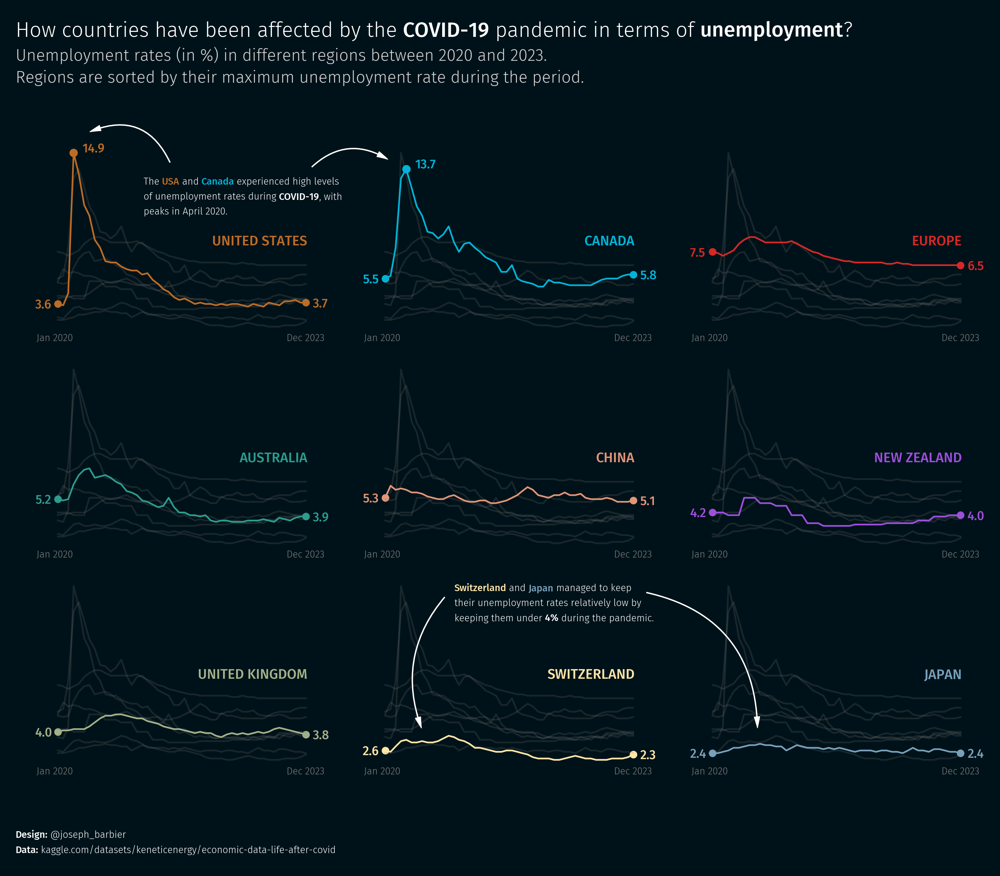
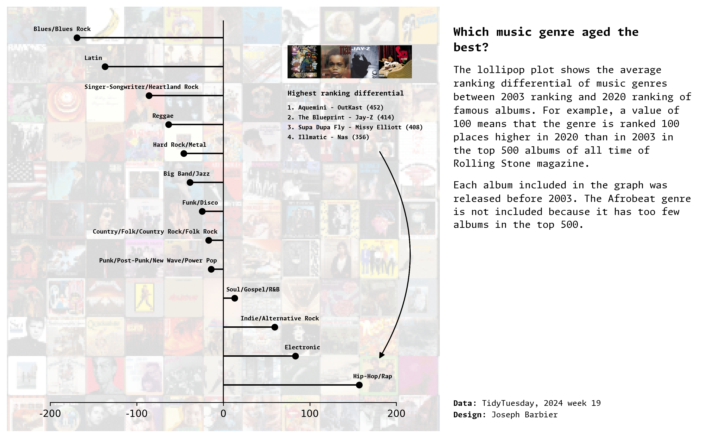

# miscellaneous dataviz

Here are some small projects that I have worked on, mainly on data visualization.

I try to always provide the code and the data used in the projects, so you can reproduce the results.

 

  
  
  

  
  
  

  
  
  

