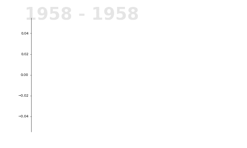

Outer space has evolved enormously since the 1960s, and has completely boomed since the 2010s.

Evolution of the number of objects put into orbit between 1958 and 2023, produced for #TidyTuesday

This animation was great fun to create and I'll probably be making more in the future!

